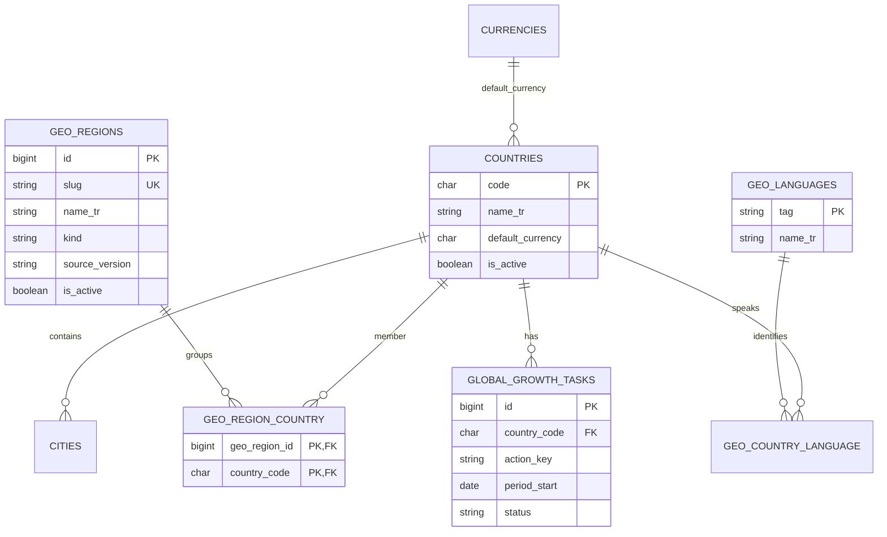
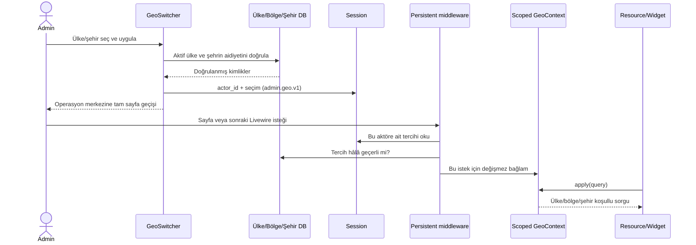

# Evrensel coğrafya ve dinamik pazar motoru

## 1. Gerçek veri modeli

Mevcut `Country` anahtarı sayısal `id` değil **`code`**; Listing, JobListing, User, DiasporaAccount ve DiasporaReel `country_code` kullanır. Şehirler `cities.id` ile kataloglanır; iş kayıtlarının şehri bugün **`city` metnidir**. Bu nedenle `country_id`, iş kayıtlarında hazır `city_id`, `Language` modeli veya ayrı `RealEstate` modeli varsayan örnekler doğrudan kullanılamaz.

`CountrySeeder` kaynak kodunda **60 ülke/bölge satırı** var; bu canlı veritabanı sayımı değildir. `XN` gibi yerel kodlar ISO kodu diye sunulmamalıdır. Geçmiş kod yorumlarındaki ülke dışlamaları yeni küresel ürün gereksiniminin karşılığı değildir. Yeni katalog ISO kayıtlarını eksiksiz içerecek; mevcut yerel uzantılar ayrı metadata ile korunacaktır. Hiçbir yeni ülke için PHP allowlist değişikliği gerekmeyecek.

ISO 3166 ülke ve ilgili alan kodlarını tanımlar; ülke sayısı, egemen devlet sayısıyla aynı kavram değildir. Katalog kapsamını sabit “200 ülke” sayısıyla değil sürümlü ISO snapshotıyla doğrulayın. [ISO 3166](https://www.iso.org/iso-3166-country-codes.html). Coğrafi bölgelerde başlangıç kaynağı UN M49 olabilir; ticari kümeler ayrıca tanımlanır. [UN M49](https://unstats.un.org/unsd/methodology/m49/).

## 2. Veri şeması



Kıta ve operasyon kümeleri çakışabilir: bir ülke hem Avrupa hem başka bir operasyon kümesinde bulunabilir. Bölge toplamları toplanarak dünya toplamı üretilmez; dünya sorgusu doğrudan ülke anahtarlarıyla tekilleştirilir. Boş bir bölge üyeliği **sıfır sonuçtur**, global fallback değildir.

Dil/para birimi bir ülkeyi tek kültüre indirgemez: `default_currency` yalnız görüntüleme varsayılanıdır; kaydın gerçek `currency` veya `salary_currency` alanı korunur. Çok dilli ülkeler pivot üzerinden bütün dilleri gösterebilir. Referans, kullanıcı arayüzünü ülke seçildi diye kendiliğinden başka dile çevirmez.

## 3. Katalog yükleme sözleşmesi

Referans migration bölge/dil tablolarını oluşturur; **ISO verisi veya uydurulmuş bölge üyeliği seed etmez**. Dağıtım için ayrı, sürümlü bir katalog importu gerekir:

1. Güvenilir ISO snapshotını ve M49 üyeliklerini kaynağı, sürüm/tarih, lisans ve SHA-256 ile sakla. Resmî listede bulunan tüm ISO alpha-2 kodları veri dosyasının anahtar kümesiyle birebir karşılaştır. `count >= 200` doğrulaması tek başına yeterli değildir.
2. Para birimlerini önce `currencies` içine yükle. Bilinmeyen para birimini EUR/USD diye doldurma. Dillerde geçerli BCP 47 etiketleri ve çoklu dil ilişkileri kullan; ülke adının çevirisini dil sınıflandırması sanma.
3. `countries.code` üzerinde upsert yap; mevcut ülke referanslarını, yönetici sırasını, yerel isim düzenlemelerini ve site tercihini gereksiz yere ezme. Yeni ISO kayıtları ürünün küresel kapsamına dahil edilir; hukuki/operasyonel kapama varsa `is_active` ve gerekçesi ayrıca yönetilir.
4. Yerel uzantıları `country_code_metadata(code, code_system, iso_alpha2, source_version)` gibi ayrı metadata ile ayır. `XN` kaydını silme veya başka ülkeye otomatik yeniden bağlama. ISO istatistiğine yerel uzantıları katma.
5. M49 kıta/bölge kayıtlarını import et. “Orta Asya & Türki Cumhuriyetler”, “Körfez & Orta Doğu”, “Asya-Pasifik” gibi operasyon kümelerini isim, amaç, sürüm ve veritabanı pivot üyeliğiyle düzenle. PHP `match(country_code)` listeleri kurma.
6. Staging raporunda eksik ISO kodları, para birimi olmayan ülkeler, dil eksikleri ve bölgesiz ülkeler **ayrı** görünsün. Katalog eksikliği “talep yok” olarak etiketlenmesin.

Bu importör ve doğrulanmış veri snapshotı paketin uygulanmış kısmı değildir; küresel dağıtımın Faz 2 kabul şartıdır. Ülke seçicisi ve sorgular bunlara bağımlı ülke sınırı içermez.

## 4. Session → middleware → sorgu akışı



Bağlam `scoped()` ile kayıtlıdır. Laravel request/queue yaşam döngüleri arasında scoped örnekleri temizler; `singleton()` uygun değildir. [Laravel container](https://laravel.com/docs/12.x/container#binding-scoped-singletons). Public siteye middleware eklenmez. Özel panel middleware'i Livewire'ın sonraki isteklerinde de tekrar uygulanır. [Livewire güvenlik ve persistent middleware](https://livewire.laravel.com/docs/3.x/security).

Session anahtarı kullanıcı kimliğiyle bağlanır. Hesap değişince eski tercih aktarılmaz. Silinen/pasifleştirilen şehir veya ülke tercihi ilk isteği 409 ile durdurur ve eski seçimi temizler; kullanıcı yenileyince global görünümü açık etiketiyle görür. Sessizce bütün dünya üzerinde eski bir eylemi çalıştırmaz.

Tam sayfa geçişi ilk sürümde bilinçli seçimdir: eski seçili tablo satırları, sayfalama ve widget belleği yeniden kurulur. Uygula düğmesi operasyon merkezine gider; açık düzenleme formunu önce kaydetme mesajı gösterilir. Gerçek zamanlı olaylı geçiş istenirse bütün tüketicilere context revision eklenip seçili kayıtlar/paginators topluca temizlenmelidir; yalnız `dispatch('geo-changed')` yeterli değildir. Birden çok sekme session'ı paylaşır; medya radarı güncellemelerinde değişen hash'i kontrol eder. Başka kaynaklardaki mutasyonlar da eski scope/hash durumunda iptal edilmeli; bu entegrasyon yapılmadan “panelin tamamı bağlı” denmez.

## 5. Neden model GlobalScope'u kullanılmıyor? ADR-001

| Alternatif | Fayda | Bedel / karar |
|---|---|---|
| Modellerin `booted()` metodunda session tabanlı GlobalScope | Tek noktadan çok sorguya yayılır | Vitrin, kuyruk ve route binding'e sızar; uzun ömürlü worker hatası riski. Seçilmedi. |
| Yalnız Resource sorgusuna eklenen Scope nesnesi | Resource içinde otomatik, model global scope'u yok | Widget/raporlar için yine ayrı bağlantı gerekir. Kabul edilebilir alternatif. |
| Açık `GeoContext::apply($query)` | Etki alanı görünür, kolay test, CLI varsayılanı global | Her tüketicinin entegre edilmesi gerekir. **Referansın kararı.** |

```php
// ListingResource / JobListingResource / UserResource / Diaspora*Resource
public static function getEloquentQuery(): \Illuminate\Database\Eloquent\Builder
{
    $query = parent::getEloquentQuery(); // mevcut authorization/soft-delete davranışını koru
    if (config('global-command.enabled') && auth()->user()?->isAdmin()) {
        $query = app(\App\Support\GlobalCommand\GeoContext::class)->apply($query);
    }
    return $query;
}
```

Bu örnek mevcut override varsa onunla birleştirilir; ikinci bir aynı adlı metot eklenmez. Listing tablosunda `with(['user', 'country', 'category.parent'])` ayrı performans düzeltmesidir. JobListing başvuru aksiyonunda hazır `applications_count` kullanılır. Ülke katalog kaynağında `country_code` bulunmadığından `apply()` kullanmayın; katalog için `countries()` vardır. Diğer modeller farklı şemadaysa kendi adaptörüne ihtiyaç duyar.

İlişkili kayıt üzerinden türeyen metriklerde lens parent'a uygulanır: örneğin değerlendirme → ilan ülkesine, iş başvurusu → iş ilanı ülkesine. Sunucu sağlığı, başarısız worker ve entegrasyon kesintisi gibi **altyapı metrikleri küreseldir**; seçili ülkenin sağlığı gibi gösterilmez. Bu kartların etiketi “Tüm sistem” olmalıdır.

## 6. Likidite ve cold-start

Referans ilk sürümde 5 kaynak için gruplanmış SQL sayımları, ülke kataloğu ve dil listesi kullanır: ülke sayısıyla artan N+1 sorgusu yoktur. Büyük tabloları `get()` ile modele doldurmaz. Aktif ülkelerden başlayıp sözlükleri sıfırla birleştirdiği için ilanı ve hesabı olmayan ülke görünür kalır. Cache anahtarı `metric_version + context hash`, TTL 60 saniyedir. Çıktıda ölçüm zamanı bulunur.

`L=aktif gerçek ilan`, `J=süresi geçmemiş aktif iş`, `U=aktif gerçek kullanıcı`, `A=aktif doğrulanmış diaspora hesabı`:

```text
S = round(40 × min(L/100,1) + 20 × min(J/40,1)
        + 25 × min(U/200,1) + 15 × min(A/10,1))
Cold-Start: L + J = 0 veya A = 0
Mature: diğer durumlarda S ≥ 70, L ≥ 20 ve U ≥ 20
Growing: kalan pazarlar
```

Bunlar kalibre edilmemiş ürün başlangıç eşikleridir. Yüksek ilan hacminde diaspora hesabı sıfırsa cold-start **topluluk açığı** anlamına gelir; gerçek ticaret likiditesi yok denmez. İkinci sürümde ilan başına nitelikli temas, ilk yanıt süresi, arama arz karşılama oranı ve başarılı eşleşme ölçümleri eklenmelidir. Kaynak ülke nüfusundan başarı oranı tahmini yapılmaz.

Demo ilan/kullanıcılar dışlanır. İşlerde henüz ayrı demo işareti yoksa bu veri kalitesi borcu görünür olmalıdır. Ülkesi bilinmeyen ve pasif ülkeye bağlı kayıtlar ülke radarının toplamına girmez; global admin hacim sayacı ayrı “bilinmeyen/pasif ülke” kovasıyla tamamlanmalıdır. Farklı para birimlerindeki fiyatlar **toplanmaz**. Şehir lensinde mevcut tam şehir adı eşleşmesi vardır; alternatif yazımlar için `city_id` backfill ve alias tablosu sonraki zorunlu normalizasyon adımıdır.

`global-command:plan-cold-start` bütün aktif ülkeleri session kullanmadan tarar. Ülke + eylem türü + hafta başlangıcı unique anahtarıyla iç görev açar; tekrar çalıştırmak aynı daveti çoğaltmaz. Görev durumları sonraki fazda `suggested → approved → queued → completed/failed/cancelled` olarak işlenir. Referans otomatik **iç görev** üretir; e-posta/sosyal davet göndermez. Dış gönderim için mevcut izinli outreach hattı, opt-out, ülke/kanal sınırı, onay ve outbox eklenir. İçerik AI taslağı da bu göreve bağlanabilir.

## 7. Ölçeklenme yolu ve ADR-002

60 saniyelik ham aggregate başlangıç kararıdır; ölçülmeden ayrı mikroservis veya event streaming eklenmez. Cache miss süresi hedefi aşınca `country_daily_metrics(country_code, city_id, date_utc, metric_version, source_watermark)` özetlerine geçilir. Sıfır ülkeler yine katalogla LEFT JOIN edilir. Zaman damgası ve gecikmiş iş göstergesi kullanıcıya gösterilir.

MySQL `EXPLAIN ANALYZE` ile mevcut indexleri inceleyin. Adaylar: Listing `(country_code,status,is_demo)`, JobListing `(country_code,status,deadline)`, User `(country_code,status,is_demo)`, DiasporaAccount `(country_code,is_active,is_verified)`, DiasporaReel `(country_code,status,id)`. Şehir kullanımına göre `(country_code,city,...)` varyantı değerlendirilir. Bütün önerileri körlemesine eklemek yazma maliyetini artırır; hedef veri ve sorgu planı olmadan index kazancı iddia edilmez.

Bölgesel admin rolü geldiğinde bütün raw sorgulara ayrı AuthorizationScope uygulanır; etkili kapsam `yetki ∩ görünüm` olur. Cache anahtarına authorization revision/izin kümesi hash'i eklenir. Mevcut referans yalnız tüm ülkelere yetkili aktif admin içindir; bölgesel RBAC uygulanmış sayılmaz.
