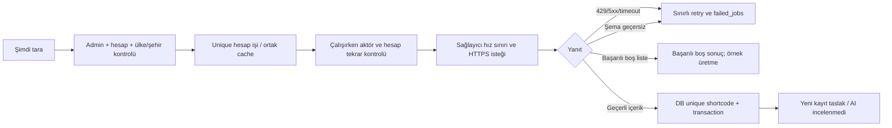

# Diaspora sosyal ve medya radarı

## Arayüz ve veri akışı

[DiasporaMediaRadar.php](reference/app/Filament/Pages/DiasporaMediaRadar.php) Filament Page, [Blade görünümü](reference/resources/views/filament/pages/diaspora-media-radar.blade.php) medya duvarıdır. Sayfa başına 12 içerik, `country` ve `account` eager loading, deterministik ID sırası ve `simplePaginate` kullanır. Böylece tüm arşiv için COUNT sorgusu gerektirmez. Filtreler: tümü, taslak, yayımlanmış, arşiv ve inceleme gerekli.

Her kart içerik, konum, hesap, yayın durumu, ön tarama puanı ve kaynak etkileşimini ayrı gösterir. Video yalnız önizleme düğmesine basılınca tek iframe olarak yüklenir. Ekrandaki 12 kart 12 videoyu otomatik başlatmaz. `RadarMediaUrl`, HTTPS ve kesin alan adı/path doğrulamasından sonra canonical Instagram embed URL'sini oluşturur; mevcut gevşek shortcode ayrıştırıcısına ham URL teslim edilmez. CDN görselleri yalnız izinli alan adlarından yüklenir. Tarayıcı önizleme gösterirken dış kaynağa istek yapar; referans testleri gerçek ağ çağrısı yapmaz.

Sayfa ve her eylem aktif admin erişimini denetler. İstemci ID'si güvenilir değildir: önizleme/doğrulama/sync eylemleri hedefi tekrar coğrafi sorgudan getirir. Başka ülkenin ID'sini göndererek bağlam atlanamaz. `Locked` property tek başına yetki denetiminin yerine geçmez. [Livewire property güvenliği](https://livewire.laravel.com/docs/3.x/properties#authorizing-the-input).

Hesap ekleme mevcut `DiasporaAccountResource` formuna gider. “Doğrula” insanın dış kaynaktan doğruladığı hesabı bir transaction içinde audit ile işaretler; gerçek kaynak sahipliğini otomatik ispatlamaz. Boş hesapların eklenmesi/doğrulanması mevcut hesap kaynağından yapılabilir. Dağıtımda mevcut hesap formunun `is_verified=false`, `autopilot=false` varsayılanlarını güvence altına alın ve Resource sync aksiyonunu yeni işe bağlayın.

## IntelligenceScoreBadge sözleşmesi

Mevcut `safety_score` bir AI modeline dayanmıyor. Bu nedenle [IntelligenceScore](reference/app/Support/GlobalCommand/IntelligenceScore.php) ve [rozet](reference/resources/views/components/intelligence-score-badge.blade.php) şu ayrımı yapar:

| Veri | Gösterim |
|---|---|
| Null/geçersiz safety puanı | Ön tarama: İncelenmedi |
| 0–59 veya rejected | Risk sinyali |
| 60–84 veya review_needed | İnceleme gerekli |
| 85–100 ve safe | Düşük risk sinyali |
| AI model/sürüm/içerik hash'iyle kayıt yok | AI: İncelenmedi |

Yüksek etkileşim güvenli içerik demek değildir. Düşük risk sinyali de insan doğrulaması değildir. Risk puanı ile güven puanının yönleri karıştırılmaz. Sonradan eklenecek AI sonucu, Faz 4 belgesindeki sürümlü değerlendirme tablosundan, aynı içerik hash'ine aitse okunacaktır. AI çalıştırılmadan yeşil “AI onaylı” etiketi üretilmez.

## Tek hesap senkronizasyonu

[SyncDiasporaAccount](reference/app/Jobs/GlobalCommand/SyncDiasporaAccount.php) işi ve [StrictDiasporaSync](reference/app/Support/GlobalCommand/StrictDiasporaSync.php) referans adaptörü mevcut sahte veri fallback'ini çağırmaz. Bu yol **varsayılan kapalıdır** ve yalnız ayrı queue worker'a gönderilir.

Uygulanan referans davranışı:

- Sabit desteklenen sağlayıcı hostu; kullanıcıya verilen URL'ye sunucudan istek yok. Redirect kapalı, connect timeout 5 sn, toplam HTTP timeout 15 sn.
- Job timeout 45 sn, 5 deneme, 60/120/240/480 sn backoff; timeout'u aşan kilit süresi 90 sn. Paylaşılan cache üzerinde aynı hesap için unique iş ve sağlayıcı çapında dakika sınırı.
- Tek yanıttan en fazla 30 içerik; hatalı kimlik/yanıt şeması hata verir. Başarılı boş liste ayrı durumdur. Sahte hesap, shortcode, izlenme veya beğeni üretilmez.
- Yeni içerik daima `draft`, `is_active=false`, `safety_score=null`. Eksik kaynak metrikleri NULL'dır. Tekrarda kayıt çoğalmaz; aynı hesaba ait mevcut kaydın kaynak metrikleri güncellenir, editoryal metin/yayın durumu ezilmez.
- DB unique kısıtı eşzamanlı yazmanın son korumasıdır. Aynı içerik başka hesapla gelirse sahiplik sessizce taşınmaz. MySQL shortcode alanı case-sensitive hale gelir.

**Tam ingest platformu için kalanlar:** sağlayıcı sözleşmesi yerel mevcut koddan uyarlanmıştır, canlı API ile teyit edilmedi. Sağlayıcı pagination/cursor, kaynak post türü (reel/image), erişim ve kullanım yetkisi, HTTP yanıt boyutu sınırı, metrik gözlem tarihi/provenance, `Retry-After`, terminal 401/403'te erken bırakma ve devre kesici üretim adaptöründe tamamlanmalıdır. Referans ilk sayfayla sınırlıdır; tam hesap geçmişini çektiği iddia edilmez. Kuyrukta hız sınırı nedeniyle release edilen işler deneme sayısı tüketebilir; yoğun kuyrukta retryUntil/ayrı kota planlayıcısı ve jitter gerekir.

Eski kaynak kayıtlarının metriklerinin gerçekliği yalnız yeni adaptör kurularak geriye dönük doğrulanamaz. Denetim raporu H01'e göre eski fallback içeriklerini ayrı raporlayıp inceleyin; bilinmeyen değerleri topluca gerçek/sıfır ilan etmeyin.

## Dağıtım önkoşulları

1. Shortcode tekrarlarını salt okunur raporlayın; sahipliği ve korunacak ID'yi belirlemeden kayıt silmeyin. Referans migration duplicate varsa durur. Case-sensitive dönüşüm ve unique index için MySQL staging zorunludur.
2. `views_count`/`likes_count` NULL kabulü sonrasında mevcut vitrin/table/ranking tüketicilerindeki `number_format`, sıralama ve toplam davranışlarını kontrol edin. Referans radar NULL'ı “Ölçülmedi” gösterir; eski uygulama henüz uyarlanmamıştır.
3. Bütün web sync aksiyonlarını queue dispatch'e çevirin; eski `syncAll()` ve örnek seed otomasyonunu devreden çıkarın. Yeni servis eski aksiyonları kendiliğinden değiştirmez.
4. Queue ve cache bütün uygulama sunucularında aynı ortak database/Redis olmalı. `WithoutOverlapping` varsayılan cache'i kullandığından `CACHE_STORE` da paylaşılan ve kilit destekli aynı ortamı göstermeli.
5. `retry_after > job timeout` olmalı; bu iş için en az 90 sn, worker `--timeout=45`. Mevcut diğer kuyrukların daha uzun timeout gereksinimlerini düşürmeyin. [Laravel queue timeout ilişkisi](https://laravel.com/docs/12.x/queues#job-expiration).
6. Feature flag'i önce staging'de tek test hesabıyla açın. Sağlayıcı 429, 5xx, bozuk JSON, boş liste, eksik metrik, duplicate ve izin kaybını doğrulayın. Daha sonra sınırlı üretim hesabı grubuna açın.
