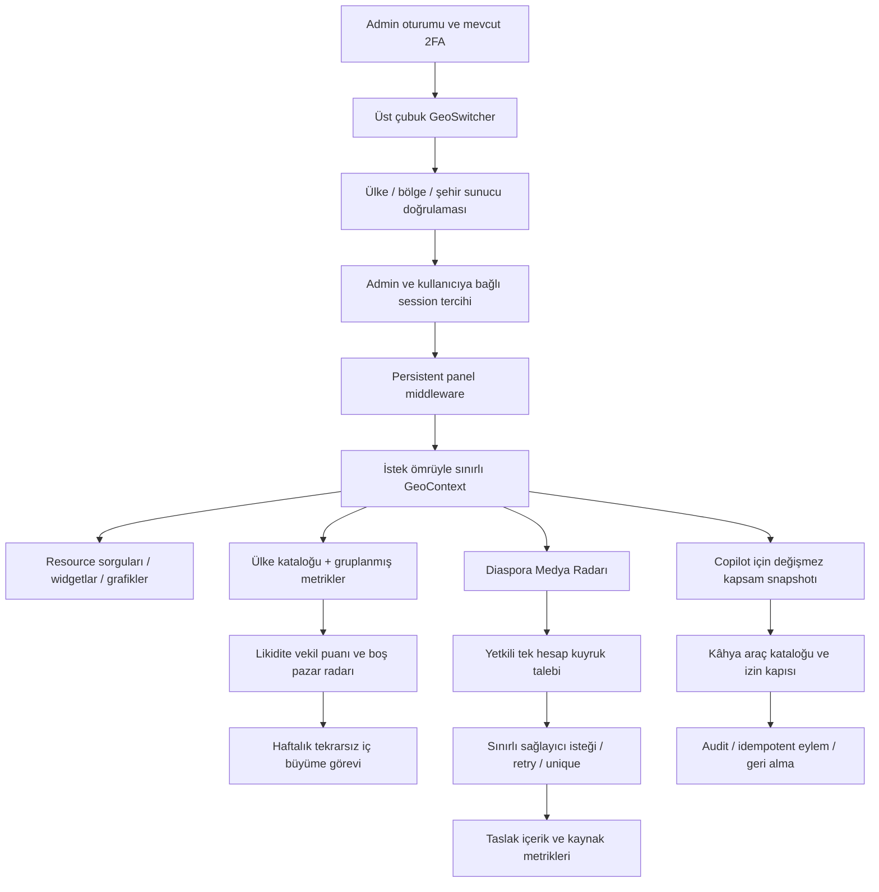

# NISOYA Küresel Operasyon Merkezi

Güncelleme: 15 Eylül 2026. Kullanıcının başlatma talebiyle **uygulama entegrasyonu yerel ortamda gerçekleştirildi**. Yedi migration uygulandı, 249 ISO ülke/bölge kataloğu yüklendi, mevcut XN kodu korundu ve 250 iç büyüme önerisi oluşturuldu. Şehir adları eşleştirme ve büyüme görevi takibi eklendi; 185 test geçti. Canlı sunucuya dağıtım veya dış mesaj gönderimi yapılmadı. Güncel dosyalar, doğrulama ve dağıtım adımları: **[IMPLEMENTATION.md](IMPLEMENTATION.md)**. Aşağıdaki referans belgeleri ilk tasarım aşamasını kaydeder; güncel uygulama kodu esas alınmalıdır.

Depo Laravel **13.31.0**, Filament **5.8.1**, Livewire **4.4.4**, PHP **8.3** ve Tailwind **4** kullanıyor. İstekte belirtilen Laravel 12 / Filament 3 / Livewire 3 için ayrı kaynak uyarlamaları verilir. Üretimde sürüm düşürülmesi önerilmiyor.

## Teslim haritası

| Çıktı | Dosya |
|---|---|
| Faz 1: dosya/satır kanıtlı sağlık denetimi | [01-health-audit.md](01-health-audit.md) |
| Faz 2: coğrafya şeması, sorgu ve bağlam akışı | [02-geo-architecture.md](02-geo-architecture.md) |
| Faz 3: medya, puan, senkronizasyon sözleşmesi | [03-media-radar.md](03-media-radar.md) |
| Faz 4: mevcut Kâhya üzerinden yönetici copilot | [04-ai-copilot.md](04-ai-copilot.md) |
| Faz 5, dosya listesi, kurulum, doğrulama, geri dönüş | [05-rollout.md](05-rollout.md) |
| Mevcut depoya uygun bağımsız kaynak paketi | [reference/](reference/) |
| Filament v3 için değişen sınıflar | [filament-v3/](filament-v3/) |
| Gerçekleştirilen doğrulama ve sınırları | [VALIDATION.md](VALIDATION.md) |

## Mimari kararın özü

Ülke bir kod içinde sabitlenen pazar listesi değildir. `countries` kataloğu bütün ISO 3166-1 ülke/bölgelerini barındırır; kıta ve operasyon kümeleri veritabanındaki çoktan çoğa üyeliklerdir. İlanı olmayan ülke sorgudan düşmez. Coğrafi görünüm, yöneticinin yetkilerinden bağımsız bir filtre tercihidir.

## Öncelikli kararlar

1. **Doğru veri önce gelir.** Denetimde bulunan örnek içerik ve üretilmiş etkileşim geri dönüşü kaldırıldı. Yeni taramalar doğrulanmış hesaplardan taslak oluşturur; bilinmeyen ölçüm sıfır gibi gösterilmez.
2. **GlobalScope modellerin tümüne eklenmez.** Session'a bağlı bir model scope'u vitrin, CLI ve kuyruk işlerini yanlış filtreleyebilir. Referans kod açık `GeoContext::apply()` kullanır; Filament kaynak adaptasyonu zorunlu kontrol listesiyle yapılır.
3. **Puanın neyi ölçtüğü görünürdür.** İlk puan ilan/iş/kullanıcı/doğrulanmış hesap arzından türetilir. İşlem likiditesi, gerçek dünya pazar büyüklüğü veya doğrulanmış AI sonucu diye gösterilmez.
4. **Mevcut Kâhya geliştirilir.** Yeni ve paralel bir yönetici asistanı yerine mevcut araç, audit ve geri alma altyapısı genişletilir. Kamu arama yönlendiricisi yönetici yetki sınırı olarak kullanılmaz.
5. **Ağ ve model çağrısı render'da çalışmaz.** Medya ve AI sonuçları kuyrukta hazırlanır. Arayüz sınırlı sayıda kayıt ve önceden hesaplanmış sonuç okur.

## Kod paketinin sınırı

`reference/` ilk tasarımın arşividir; normal uygulama autoload'una katılmaz. Güncel uygulama `app/`, `config/`, `database/` ve `resources/` altında bulunur; ayrıca tam ülke kataloğu, kaynaklara bağlı filtreler, kalite kuyruğu ve Kâhya aracı içerir. Referans dosyaları güncel uygulamanın üzerine kopyalanmamalıdır.

**Üretim kabulünde kalanlar:** canlı sağlayıcı sözleşmesi, MySQL üzerinde eşzamanlılık/yük ve gerçek cihazlarda oturumlu tarayıcı kontrolleri. Yerel entegrasyon bu kontrollerin tamamlandığı anlamına gelmez. Kapsam ve sınırlar IMPLEMENTATION.md içinde listelenir.

Talep edilen üç ana kod giriş noktası:

- [Global GeoContext Header / Switcher](reference/app/Livewire/Admin/GeoSwitcher.php) ve [Blade görünümü](reference/resources/views/livewire/admin/geo-switcher.blade.php).
- [Universal ülke likidite widgetı](reference/app/Filament/Widgets/CountryLiquidityWidget.php), [metrik servisi](reference/app/Support/GlobalCommand/CountryLiquidity.php) ve [görünümü](reference/resources/views/filament/widgets/country-liquidity.blade.php).
- [Diaspora Medya Radarı](reference/app/Filament/Pages/DiasporaMediaRadar.php) ve [görünümü](reference/resources/views/filament/pages/diaspora-media-radar.blade.php).
